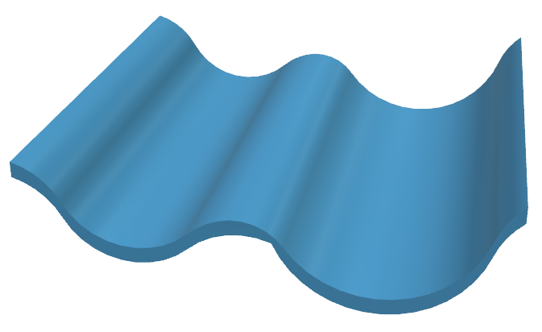

+++
title = "Computing at the aggregate level"
outputs = ["Reveal"]
[reveal_hugo]
theme = "blood"
slide_number = "true"
+++

## Computing at the *[aggregate](https://ieeexplore.ieee.org/document/7274429)* level

[Danilo Pianini](http://www.danilopianini.org), Mirko Viroli, Roberto Casadei

<footer>
  <div style="font-size: 80%"> University of Bologna</div>
</footer>

---



---



<section data-noprocess>
  <ul>
    <li class="fragment fade-in-then-semi-out" data-fragment-index=6>"Situatedness"</li>
    <li class="fragment fade-in-then-semi-out" data-fragment-index=4>Unpredictability (humans)</li>
    <li class="fragment fade-in-then-semi-out" data-fragment-index=1>High density</li>
    <li class="fragment fade-in-then-semi-out" data-fragment-index=2>Heterogeneity</li>
    <li class="fragment fade-in-then-semi-out" data-fragment-index=3>Mobility</li>
    <li class="fragment fade-in-then-semi-out" data-fragment-index=5>Openness</li>
    <li class="fragment fade-in-then-semi-out" data-fragment-index=7>Safety concerns</li>
  </ul>
</section>

{}


{}

---

<video width="120%" height="120%" autoplay controls loop><source data-src="video/stampede.mp4" type="video/webm" /></video>

---



### Engineering this thing I

Throw everything at the cloud, and let it process it



* 
* 
* 
* 

---



### Engineering this thing II

Rely on opportunistic communication



* 
* 
* 
* 
    

---

{}

### Local-to-global

> something as small as the flutter of a butterfly's wing can ultimately cause a typhoon halfway around the world

* Controlling emergency is **hard**
* Engineers don't like lack of control

---

#### The good part

Basically the foundation of

* Stigmergy
* Nature inspired coordination

> simple behavioural and communicational rules, global effects

---

#### Side effects on multiple scales

**simple** *local* behaviours

<p class="fragment" data-fragment-index=1> ↓↓↓ </p>
<p class="fragment" data-fragment-index=1> <b>complex</b> <i>global</i> behaviour </p>





---

#### The bad part

emergent behaviour is difficult to forecast

> simple behavioural and communicational rules, global effects

<p class="fragment" data-fragment-index=1> ↓↓↓ </p>

<blockquote class="fragment" data-fragment-index=1> small mistakes, global consequences</blockquote>

---

#### The bad part

* 
* 
* 



{}

---



#### Aggregate programming: idea


devices

---



#### Aggregate programming: idea


logical network

---



#### Aggregate programming: idea


each device holds some values

---



#### Aggregate programming: idea


interpret such values as a field in space-time

---



#### Aggregate programming: idea


(computational field)

---



#### Aggregate programming: idea


↑↑↑ Compute on these things ↑↑↑

---



### Aggregate programming

* our machine is the *ensemble* of situated devices
* computing happens by means of combining fields
<p class="fragment fade-in">straightforward mapping to functional languages</p>
<ul>
  <li class="fragment fade-in">compositionality by function composition (<i>divide et impera</i>)</li>
  <li class="fragment fade-in">nothing new, software people know them already!</li>
  <li class="fragment fade-in">networking and platform hidden under the hood</li>
</ul>

---



<section data-noprocess>
    <p class="fragment fade-in" data-fragment-index=6><b>↓Nice place to work↓</b></p>
    <p class="fragment fade-in" data-fragment-index=5>Reusable aggregate library</p>
    <p class="fragment fade-in" data-fragment-index=4>Self-stabilizing blocks</p>
    <p class="fragment fade-in" data-fragment-index=3>Language primitives</p>
    <p class="fragment fade-in" data-fragment-index=2>Interpreter</p>
    <p class="fragment fade-in" data-fragment-index=1>Device abstraction (sensors, actuators)</p>
    Underlying platform (cloud? actors? LoRaWAN?)
</section>

---



{}
### The feel of it

<video width="100%" height="80%" autoplay controls><source data-src="video/ieeeiot-upgrade.mkv" type="video/webm" /></video>
[red](https://vimeo.com/260445665) means overcrowding

---

### The feel of it

```java
import ...
// A field counting people around each point in space
def countNearby(range) {
  let human = rep(h <- env.has("human")) { h };
  sumHood PlusSelf(
    mux(human && nbrRange() < range) { 1 } else { 0 })
}
```
actual code from [Modelling and simulation of Opportunistic IoT Services with Aggregate Computing](https://doi.org/10.1016/j.future.2018.09.005)

---

### The feel of it

```java
import ...
// A field estimating people density in an area
def densityEst(p, range, w) {
  countNearby(range) / (p * pi * range ^ 2 * w)
}
```
(actual code from [Modelling and simulation of Opportunistic IoT Services with Aggregate Computing](https://doi.org/10.1016/j.future.2018.09.005))

---

### The feel of it

```java
import ...
// A field of boolean, true if the area is overcrowded
def dangerousDensity(p, range, dangerousDensity, groupSize, w) {
  let partition = S(range, nbrRange);
  let localDensity = densityEst(p, range, w);
  let avg = summarize(partition, sum, localDensity, 0)
    / summarize(partition, sum, 1, 0);
  let count = summarize(partition, sum, 1 / p, 0);
  avg > dangerousDensity && count > groupSize
}
```
(actual code from [Modelling and simulation of Opportunistic IoT Services with Aggregate Computing](https://doi.org/10.1016/j.future.2018.09.005))

---

### The feel of it

```java
import ...
/* A field that partitions space in safe, overcrowded,
   and overcrowding areas, given a certain time window */
def crowdTracking(p, range, w, maxDense,
      dangerThr, groupSize, time) {
  if (isRecentEvent(densityEst(p, range, w) > maxDense, time)) {
    if (dangerousDensity(p, range, dangerThr, groupSize, w)) {
      overcrowded()
    } else { atRisk() }
  } else { none() }
}
// Application code: crowd density tracking in a 60s window
crowdTracking(0.005, 30, 0.25, 1.08, 2.17, 300, 60);
```
(actual code from [Modelling and simulation of Opportunistic IoT Services with Aggregate Computing](https://doi.org/10.1016/j.future.2018.09.005))

{}


---



#### Engineering toolchain

* [A higher order calculus](https://arxiv.org/abs/1610.08116)
* Two practical languages
    * [ Protelis](www.protelis.org) 
      * Java-hosted stand-alone language
    * [Scafi](https://scafi.github.io/)
      * Scala internal DSL
* Multiple simulators (it's easy to attach them)
  * [ Alchemist](https://alchemistsimulator.github.io)
     * Supports both Protelis and Scafi
  * [NASA WorldWind](https://github.com/Protelis/Protelis-Demo-Visualized)

---




#### Integration

* Requirements:
    * Devices exchange data with their "neighbors"
        * Whatever a "neighborhood" is
* No assumption on the deployment
* No assumption on communication means

---



#### Integration

Computation may happen:
<ul>
  <li>on each device</li>
  <li class="fragment fade-in">on the edge</li>
  <li class="fragment fade-in">on the cloud</li>
</ul>




---



#### Integration

No magic, deployment-specific complexity is simply incapsulated under the hood

<i></i>

* Write the application thinking of *what* it should do
* Write the platform thinking of *where* it should run
    * And reuse it for future applications

---



#### Silver bullet?

<b class="fragment fade-in" data-fragment-index=0>nope</b>

<ul>
  <li class="fragment fade-in-then-semi-out" data-fragment-index=1>Very handy for expressing the "coordination"</li>
  <li class="fragment fade-in-then-semi-out" data-fragment-index=2>Other paradigms are better at the good ol' "local" programming</li>
  <ul>
    <li class="fragment fade-in-then-semi-out" data-fragment-index=2>e.g. I wouldn't develop a GUI in aggregate...</li>
    <li class="fragment fade-in-then-semi-out" data-fragment-index=2>(although technically doable)</li>
  </ul>
  <li class="fragment fade-in-then-semi-out" data-fragment-index=3>The final software is usually a mixture of paradigms</li>
</ul>

---



#### abstraction is not a free lunch

<p class="fragment fade-in" data-fragment-index=0>abstraction raised by hiding networking and protocols</p>

<ul>
  <li class="fragment fade-in" data-fragment-index=1><b>harder to optimize</b> for bandwidth saving</li>
  <ul>
    <li class="fragment fade-in-then-semi-out" data-fragment-index=2><b>application-specific optimization</b> at the platform level breaks the paradigm</li>
  </ul>
  <li class="fragment fade-in" data-fragment-index=3><b>security</b> is a serious concern</li>
  <ul>
    <li class="fragment fade-in-then-semi-out" data-fragment-index=4>Some work on <a href="https://doi.org/10.1016/j.scico.2018.07.006">application-level countermeasures</a></li>
    <li class="fragment fade-in-then-semi-out" data-fragment-index=5>Platform-level attacks disrupt the paradigm</li>
    <ul>
      <li class="fragment fade-in-then-semi-out" data-fragment-index=5>A work on this <a href ="http://pccmvo-goodtechs-2018.surge.sh/">is being presented right now</a></li>
    </ul>
  </ul>
</ul>

---



#### Conclusion

* engineering applied to the problem, regardless of the underlying platform
    * first *what* 
    * then *where* 

---



#### Conclusion

* language-based, top-down, global-to-local
    * easier design
    * high composability
    * better guarantees

---



#### Conclusion

* rich set of tools
* lots of work to do on optimization and security

<p class="fragment">
<b>enabling technology</b> for projects dealing with the <b>Internet of Things</b> and <b>Smart Cities</b>
</p>


---

#### Appendix: play with it!

[A tutorial for learning Protelis](https://www.slideshare.net/DanySK/practical-aggregate-programming-with-protelis-saso2017) is available

Scafi is better learned by reading [a paper](https://link.springer.com/chapter/10.1007/978-3-030-00302-9_4) (for now)
